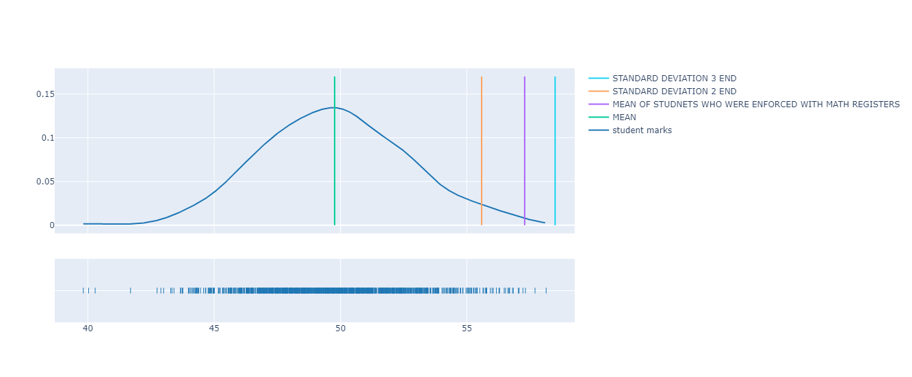

# Single Sample Z-tests

Single Sample Z-tests is the example of analyzing the articlele's data and seeing the results are changing after the introduction of an intervention. Made By [Junaid](https://abujuni.dev).

=> **Made By [Junaid](https://abujuni.dev) .**
